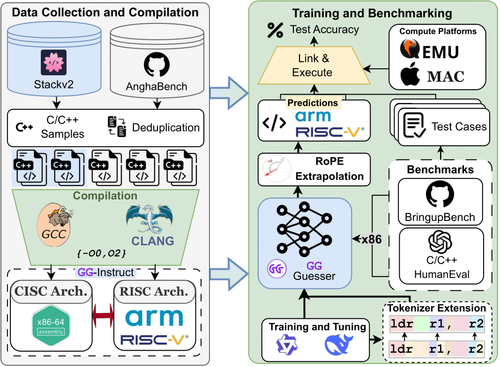
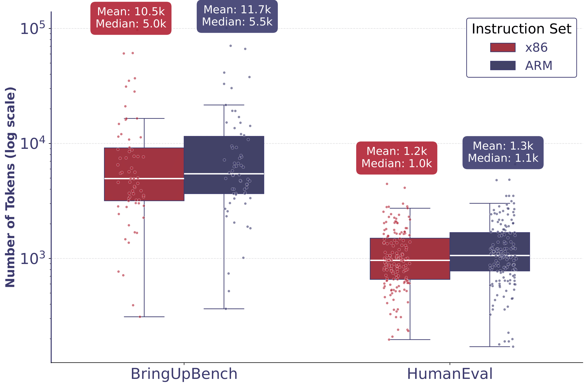
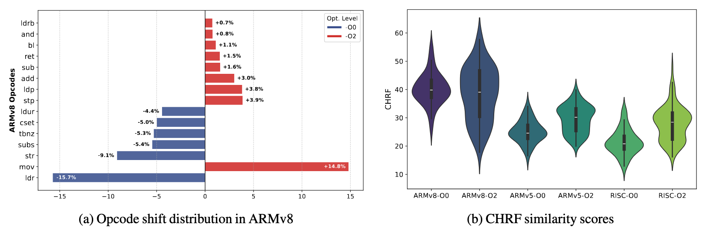

<div align="center">
  
</div>

<div style="margin-top:50px; margin-left: 12%;">
  <h1 style="font-size: 30px; margin: 0;"> Guaranteed Guess: A Language Modeling Approach for CISC-to-RISC Transpilation with Testing Guarantees [EMNLP 2025 🔥]</h1>
</div>

<div align="left" style="margin:24px 0;">
  
</div>

<p align="center">
  <a href="https://ahmedheakl.github.io/Guaranteed-Guess/"></a>
  <a href="https://arxiv.org/abs/2506.14606?"></a>
  <a href="https://huggingface.co/collections/ahmedheakl/guaranteed-guessing-67f7c4f7bf3b9bcf174ecab7"></a>
  <a href="https://huggingface.co/collections/ahmedheakl/guaranteed-guessing-67f7c4f7bf3b9bcf174ecab7"></a>
</p>

<p align="center">
  <a href="https://www.linkedin.com/in/ahmed-heakl/"><b>Ahmed Heakl</b></a>, 
  <a href="https://www.linkedin.com/in/sarim-hashmi-b10b35136/"><b>Sarim Hashmi</b></a>, 
  <a href="https://www.linkedin.com/in/chaimaa-abi-2555a31b3/"><b>Chaimaa Abi</b></a>, 
  <a href="https://celine-lee.github.io/"><b>Celine Lee</b></a>,
   <a href="https://ma3mool.github.io/"><b>Abdulrahman Mahmoud</b></a>,
</p>


<p align="center">
  <b>MBZUAI</b> · <b>Cornell University</b>
</p>

---

## 🆕 Latest Updates
- 📢 **August 2025**: We're thrilled to share that GG has been accepted to *EMNLP 2025*! 🎊
- 📢 **June 2025**: Evaluation code for Bringup-Bench is released. Checkout `eval` folder!
- 📢 **June 2025**: Paper and inference code is released!


## Overview

The hardware ecosystem is rapidly evolving, with increasing interest in translating low-level programs across different instruction set architectures (ISAs) in a quick, flexible, and correct way to enhance the portability and longevity of existing code. A particularly challenging class of this transpilation problem is translating between complex- (CISC) and reduced- (RISC) hardware architectures, due to fundamental differences in instruction complexity, memory models, and execution paradigms. 

In this work, we introduce **<span style="color:rgb(138,43,226);">GG</span>** (Guaranteed Guess), an ISA-centric transpilation pipeline that combines the translation power of pre-trained large language models (LLMs) with the rigor of established software testing constructs. Our method generates candidate translations using an LLM from one ISA to another, and embeds such translations within a software-testing framework to build quantifiable confidence in the translation. We evaluate our **<span style="color:rgb(138,43,226);">GG</span>** approach over two diverse datasets, enforce high code coverage (>98%) across unit tests, and achieve functional/semantic correctness of **99%** on HumanEval programs and 49% on BringupBench programs, respectively. Further, we compare our approach to the state-of-the-art Rosetta 2 framework on Apple Silicon, showcasing 1.73× faster runtime performance, *1.47×* better energy efficiency, and *2.41×* better memory usage for our transpiled code, demonstrating the effectiveness of **<span style="color:rgb(138,43,226);">GG</span>** for real-world CISC-to-RISC translation tasks.


<p align="center">
  
</p>


## 🚀 Highlights

- **First CISC-to-RISC Transpiler**: GG is the first CISC-to-RISC transpiler built via a custom-trained, architecture-aware LM achieving a test accuracy of 99.39% on ARMv8 and 89.93% on RISC-V64.
- **Testing-Driven Validation**: A methodology to measure and build confidence into transpilation output via software testing approaches ("guaranteeing" the guess), including detailed analysis of correctness, errors, and hallucinations.
- **Hardware-Informed Design**: An in-depth analysis into the inner workings of our transpiler, including hardware-informed design decisions to best train an accurate LLM model for assembly transpilation.
- **Real-World Case Study**: GG's generated assembly achieves 1.73× runtime speedup, 1.47× better energy efficiency, and 2.41× memory efficiency compared to Apple Rosetta's x86 to ARM virtualization engine.


## Results

<p>
    GG models significantly outperform all baseline models across different architectures and optimization levels.
    Most baseline models achieve 0% accuracy, highlighting the unique difficulty of low-level ISA translation.
</p>

<p align="center">
    
</p>

<h3 class="title is-4">Real-World Performance vs Rosetta 2</h3>
<p>
    We conducted a real-world study on Apple M2 Pro comparing GG against Rosetta 2 across
    execution time, CPU energy, and memory usage. GG achieves near-native performance while
    significantly outperforming Rosetta 2 across all metrics.
</p>

<table class="table is-bordered is-striped is-narrow is-hoverable is-fullwidth results-table">
    <thead>
        <tr>
            <th>Metric</th>
            <th>Rosetta 2</th>
            <th>GG (Ours)</th>
            <th>Native</th>
            <th>Improvement</th>
        </tr>
    </thead>
    <tbody>
        <tr>
            <td>Execution Time (ms)</td>
            <td>13.94</td>
            <td>8.03</td>
            <td>7.39</td>
            <td class="has-text-weight-bold">1.73× faster</td>
        </tr>
        <tr>
            <td>CPU Energy (J)</td>
            <td>7.50</td>
            <td>5.09</td>
            <td>5.07</td>
            <td class="has-text-weight-bold">1.47× better</td>
        </tr>
        <tr>
            <td>RAM Usage (MB)</td>
            <td>2.49</td>
            <td>1.03</td>
            <td>1.03</td>
            <td class="has-text-weight-bold">2.41× better</td>
        </tr>
    </tbody>
</table>


## Evaluation Benchmarks
<p>
We evaluate GG using two complementary benchmarks: HumanEval-C with 164 programming problems and BringUpBench with 65 bare-metal programs (85-5751 lines of code), providing comprehensive coverage from isolated functions to full project structures with internal libraries.
</p>

<p align="center">
    
</p>

<p align="center">
  <table border="1" cellspacing="0" cellpadding="6" style="margin: auto;">
    <thead>
      <tr>
        <th>Benchmark</th>
        <th>Architecture</th>
        <th>Optimization</th>
        <th>Data</th>
      </tr>
    </thead>
    <tbody>
      <tr>
        <td rowspan="6"><b>HumanEval</b></td>
        <td rowspan="2">ARMv5</td>
        <td>O0</td>
        <td><a href="https://huggingface.co/datasets/ahmedheakl/gg-bench-armv5-O0" target="_blank">Link</a></td>
      </tr>
      <tr>
        <td>O2</td>
        <td><a href="https://huggingface.co/datasets/ahmedheakl/gg-bench-armv5-O2" target="_blank">Link</a></td>
      </tr>
      <tr>
        <td rowspan="2">ARMv8</td>
        <td>O0</td>
        <td><a href="https://huggingface.co/datasets/ahmedheakl/gg-bench-armv8-O0" target="_blank">Link</a></td>
      </tr>
      <tr>
        <td>O2</td>
        <td><a href="https://huggingface.co/datasets/ahmedheakl/gg-bench-armv8-O2" target="_blank">Link</a></td>
      </tr>
      <tr>
        <td rowspan="2">RISCv64</td>
        <td>O0</td>
        <td><a href="https://huggingface.co/datasets/ahmedheakl/gg-bench-risc-O0" target="_blank">Link</a></td>
      </tr>
      <tr>
        <td>O2</td>
        <td><a href="https://huggingface.co/datasets/ahmedheakl/gg-bench-risc-O2" target="_blank">Link</a></td>
      </tr>
      <tr>
        <td rowspan="2"><b>BringUpBench</b></td>
        <td rowspan="2">ARMv8</td>
        <td>O0</td>
        <td><a href="https://huggingface.co/datasets/ahmedheakl/gg-bench-bringup-O0" target="_blank">Link</a></td>
      </tr>
      <tr>
        <td>O2</td>
        <td><a href="https://huggingface.co/datasets/ahmedheakl/gg-bench-bringup-O2" target="_blank">Link</a></td>
      </tr>
    </tbody>
  </table>

</p>

## Inference

Checkout `inference.py` for a simple script to run inference on the GG models. The script takes an input assembly file and outputs the transpiled assembly code.

Here are all the available GG models:

<table>
  <thead>
    <tr>
      <th>Model</th>
      <th>Architecture</th>
      <th>Optimization</th>
      <th>Link</th>
    </tr>
  </thead>
  <tbody>
    <tr>
      <td>GG-ARMv5</td>
      <td>ARMv5</td>
      <td>O0</td>
      <td><a href="https://huggingface.co/ahmedheakl/gg-armv5-O0" target="_blank">Link</a></td>
    </tr>
    <tr>
      <td>GG-ARMv5</td>
      <td>ARMv5</td>
      <td>O2</td>
      <td><a href="https://huggingface.co/ahmedheakl/gg-armv5-O2" target="_blank">Link</a></td>
    </tr>
    <tr>
      <td>GG-ARMv8</td>
      <td>ARMv8</td>
      <td>O0</td>
      <td><a href="https://huggingface.co/ahmedheakl/gg-armv8-O0" target="_blank">Link</a></td>
    </tr>
    <tr>
      <td>GG-ARMv8</td>
      <td>ARMv8</td>
      <td>O2</td>
      <td><a href="https://huggingface.co/ahmedheakl/gg-armv8-O2" target="_blank">Link</a></td>
    </tr>
    <tr>
      <td>GG-RISCv64</td>
      <td>RISCv64</td>
      <td>O0</td>
      <td><a href="https://huggingface.co/ahmedheakl/gg-risc-O0" target="_blank">Link</a></td>
    </tr>
    <tr>
      <td>GG-RISCv64</td>
      <td>RISCv64</td>
      <td>O2</td>
      <td>TBR</td>
    </tr>
  </tbody>
</table>


## ISA Similarity Analysis
<p>
    We observe a direct correlation between ISA similarity and transpilation accuracy. ARMv8 exhibits the highest similarity to x86 (40.19%), followed by ARMv5 (25.09%) and RISC-V64 (21.41%), directly correlating with model accuracy performance across these architectures.
</p>

<p>
    Additionally, we analyze how compiler optimization levels affect opcode usage patterns in ARMv8. At -O2 optimization, mov instructions become dominant (+14.8%), indicating more register reuse and reduced memory traffic, which makes the learning task more challenging for the model.
</p>

<p align="center">
    
</p>


## Todos

- [ ] Release training and evaluation scripts.
- [ ] Release dataset compilation scripts.


## Citation
If you use this code or the dataset in your research, please cite our paper:

```bibtex
@article{heakl2025guaranteed,
  title={Guaranteed Guess: A Language Modeling Approach for CISC-to-RISC Transpilation with Testing Guarantees},
  author={Heakl, Ahmed and Hashmi, Sarim and Abi, Chaimaa and Lee, Celine and Mahmoud, Abdulrahman},
  journal={arXiv preprint arXiv:2506.14606},
  year={2025}
}
```
